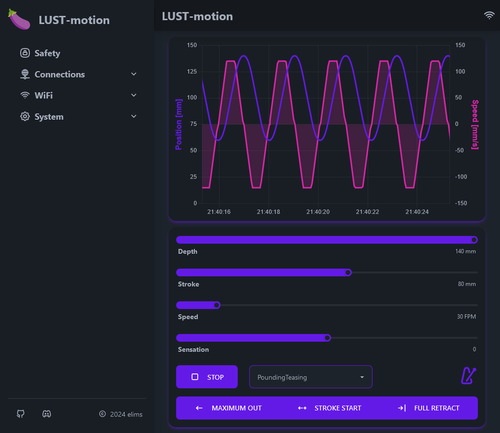

# Get Started with LUST-remote

LUST-motion is a control firmware for fucking machines controlled by an ESP32 using a stepper or servo motor. It is especially geared towards [OSSM](https://github.com/KinkyMakers/OSSM-hardware) and runs on the [OSSM Reference Board V1 and V2](https://www.researchanddesire.com/products/ossm-reference-board) sold by [Research and Desire](https://www.researchanddesire.com/). But the flexible structure of the code allow easy adaptation to different PCB's. It can work with any stepper or servo motor which accepts the STEP/DIR interface out of the box. However, it is easily possible to extend this to other drivers like linmot linear motors.

## Install the Firmware
